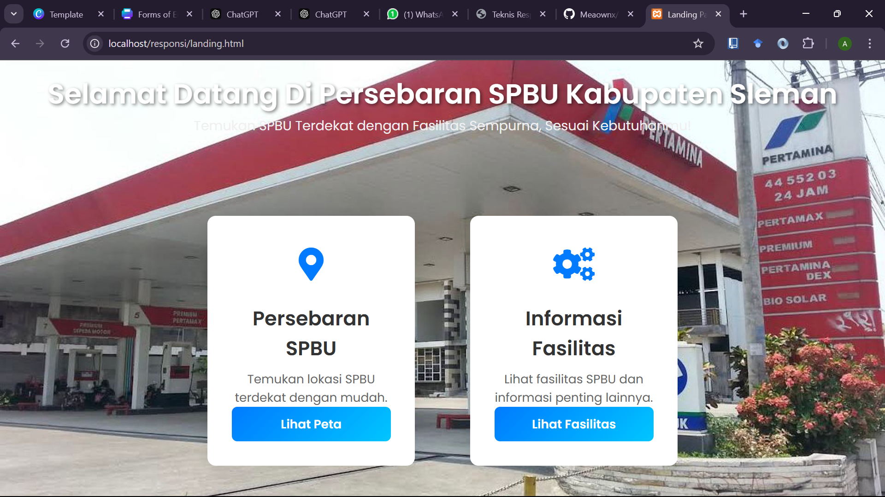
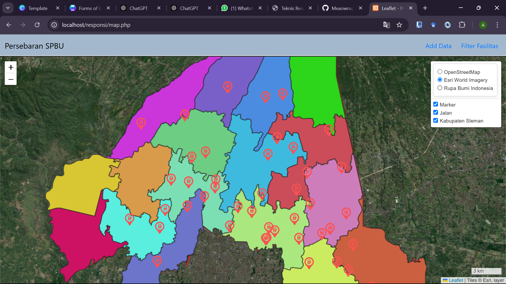
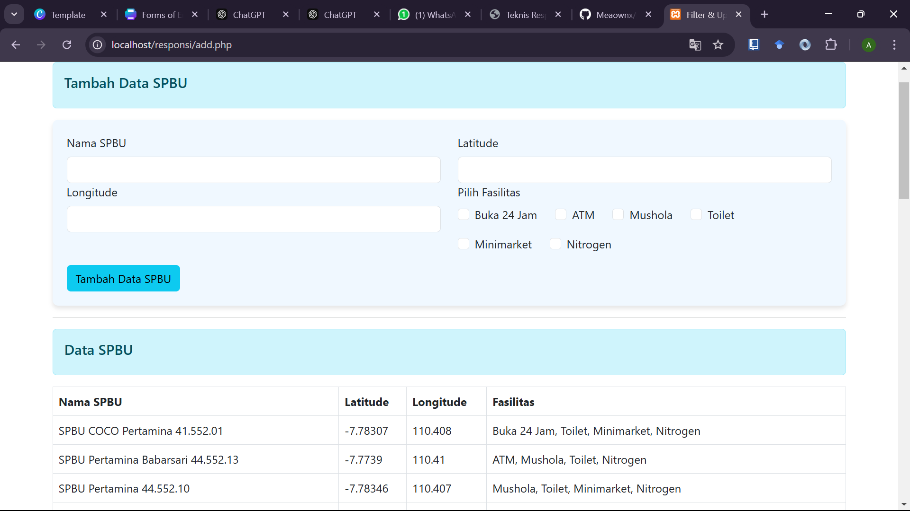
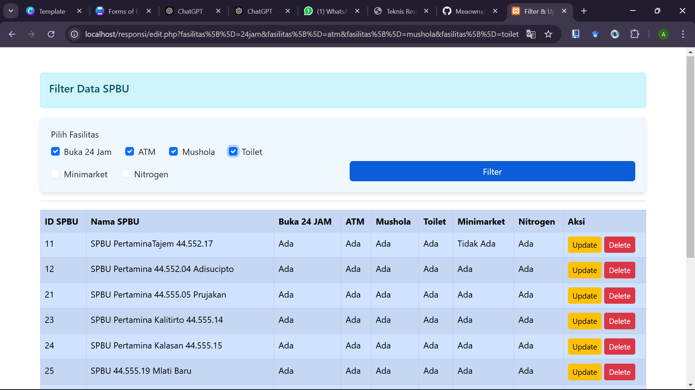
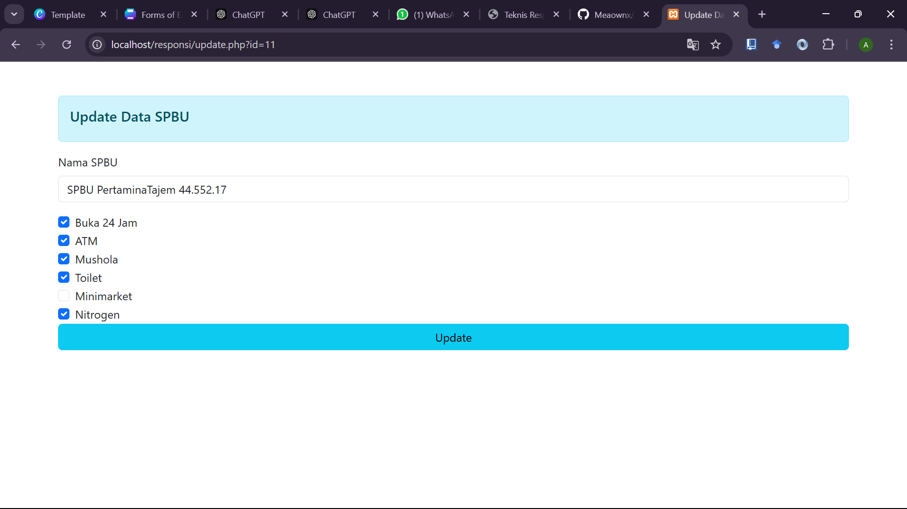

# PERSEBARAN SPBU KABUPATEN SLEMAN (Temukan SPBU Terdekat dengan Fasilitas Sempurna, Sesuai Kebutuhanmu!)

Projek ini diguanakan untuk mempermudah masyarakat khususnya wisatawan untuk mencari SPBU terdekat untuk beristirahat maupun melakukan pengisian bahan bakar. projek ini juga membantu dalam mengurangi waktu pencarian lokasi pemberhentian dikarenakan bisa melakukan filter pada fasilitas yang ada.

# Tujuan

- Menyediakan informasi yang cepat serta akurat mengenai lokasi SPBU khususnya di Kabupaten Sleman
- Mempermudah masyrakat khususnya pendatang
- Adanya fungsi filter mempermudah dalam memilih SPBU yang sesuai kebutuhan

# Komponen Pengembang"

1. Database SPBU (Menggunakan PHPMyAdmin)
2. Library Leaflet JS
3. Geospatial Web Map Service (WMS) (Menggunakan Geoserver dan Geoportal)
4. Bootstrap

# Sumber Data

1. Geoportal Kabupaten Sleman https://geoportal.slemankab.go.id/

# Komponen

- Landing Page : Halaman utama dari project yang terdiri dari dua button
  
- Map : Tampilan Peta Persebaran SPBU Di kabupaten Sleman yang di lengkapi dengan NAVBAR yang digunkana untuk melakukan Add Data dan Filter Data
  
- Add Data : Digunakan untuk melakukan penamabahan data serta melihat hasil data
  
- Filter Fasilitas: Digunakan untuk melakukan filter fasilitas pada informasi fasilitas didalam tabel
  
- Editing Data : Digunakan untuk melakukan editing data fasilitas dengan melakukan checklist
  
